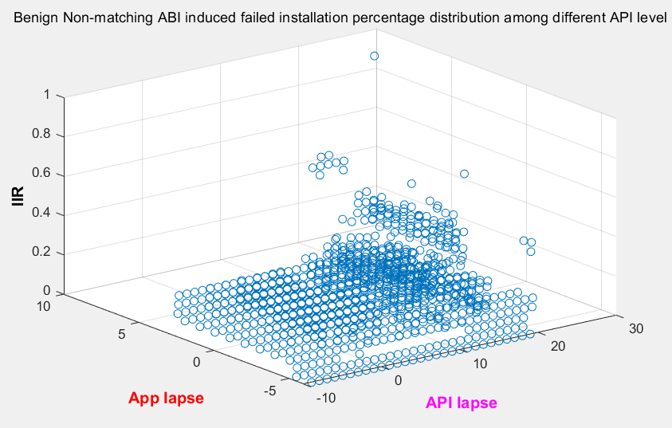

# Android Compatibility Analysis

**Catalog**

- [Installation Failure Message Explanation](#Installation-Failure-Message-Explanation)
- [Runtime Failure Message Explanation](#Runtime-Failure-Message-Explanation)
- Scripts: 

| Commands                                               | Functions                                                    |
| ------------------------------------------------------ | ------------------------------------------------------------ |
| `bash ClassifierScript/runInstallTraces.sh <Folder>`   | Analyze the installation logs inside of **Folder** and save the .txt result in InstallResult dir |
| `python ClassifierScript/install_classify.py <log>`    | Analyze a **single log** and save the .txt result in InstallResult dir |
| `python ClassifierScript/runtime_classify.py <Folder>` | Analyze the runtime logs inside of **Folder** and save the .txt result in RuntimeResult dir |
| `python DataParse/parseMinSdk.py <apks folder> <typ> <year>`         | retrived the apk's minSDKversion and save the result txt in  current directory in a generated folder|
| `python Stats.py <InstallResult/RuntimeResult>`        | Obtain the result*.txt from **Folder** and print # of success and success rate, # of fails and fail rate |
| `python BarStatIns.py <InstallResult>`                 | Calculate the installation distribution for the failures and print to the console. |
| `python BarStatRuntime.py <RuntimeResult>`             | Calculate the runtime distribution for the failures and print to the console. |
| `python SSPSwrapper.py`                                | Retrive data from InstallResult, RuntimeResult, DataParse to calculate the SPSS distribution, saved the excel result in **SSPS folder**  |
| `python MultiClassify.py <apkCSVlocatedFolder> <InstallResult OR RuntimeResult>` | classify multi-apk, consider app success if its apk(s) are compatible for covered API19,21-27 are otherwise fail, save result in **MultiCompatResult**|
| **matlab scripts located in SSPS folder** |

### Statistic Result

**IIR figure for benign Installation 2010 - 2019**

**IIR figure for benign Runtime 2010 - 2019**

**IIR figure for malware Installation 2018 - 2019**

**IIR figure for malware Installation 2010 - 2019**

**Bar Figure for benign  Installation 2010 - 2019**

**Bar Figure for benign  runtime 2010 - 2019**

**Bar Figure for malware Installation 2018 - 2019**

**Bar Figure for malware runtime 2010 - 2019**

## SSPS for benign and malware Installation

**SSPS for benign Installation ABI**

**SSPS for benign Installation All**

**SSPS for benign Installation Library**

**SSPS for malware Installation ABI**

**SSPS for malware Installation All**

**SSPS for malware Installation Library**

## SSPS for benign and malware runtime

**SSPS for benign Runtime**

**SSPS for benign Runtime verify error**

**SSPS for benign Runtime native error**

**SSPS for malware Runtime**

**SSPS for malware Runtime verify error**

**SSPS for malware Runtime native error**

**Goal**

1. Compute the android installation/runtime compatibility for Benign apps 2018-2019 and Malware apps 2010-2019.

2. Statistically analysis the Installation/Runtime Compatibility for RQs (1-6 see research paper)

3. Develop new computation method that computes the compatibility for multi-apk for 2018-2019 andriod apps
	
	**Installation-time**
	
	-	Refer to installation log
	-	For each apk that failed at installation on API X as found from the log
	-	Find all other apks that share the same package name from the large app list 
	-	For each of such found apks, install it on API X 
	-	If any of such installation succeeds, then this app (called multi-apk-compatible (MAC) app) should not be considered unable to install at API X
	
	**Run-time**
	-	Given an app, we run it on multiple different platforms (device configuration + API level) 
	-	If the app did not produce the ‘effects’ in at least one platform A, then we know this app probably does not have application/logic errors
	-	And then if this same app produces some of the ‘effect’s in another platform B, then we know this app is incompatible with this platform 
	-	Further, by knowing what we changed between A and B, we actually would also know that is the cause of the incompatibility
	-	The changes would be likely the following:
	-	Removing camera
	-	Change screen size
	-	Change SDK version
	
	**RQs (also answered for benign apps and malware separately; then we can compare between these two categories)**
	-	RQ1: Distribution of #apks per app
	-	1 for the majority of the apps
	-	Use a Histogram to present (x axis: #apks, grouped by app year), y axis: percentage)
	-	RQ2: Prevalence of MAC apps (percentage of such apps per year and per API level) - plot similarly to Figure 2 in issta paper
	-	RQ3: API level compatibility coverage of all the apks of MAC apps (essentially answer the question of how much multi-apk actually helped compatibility)
	-	E.g., originally, we considered only one apk for an app, and found it is only compatible on API X1 and API X2 (so the coverage is 2/8)
	-	Now, after considering multi-apks for this app, we found that this app is compatible on API X3, API X5 additionally (so the coverage is 4/8)

### Installation Failure Message Explanation

| Effect                                            | Explanation                                                  | Reason                                                       |
| ------------------------------------------------- | ------------------------------------------------------------ | ------------------------------------------------------------ |
| Could not access the Package Manager              | install application before even the emulator started properly ( some sort of race condition where the emulator has not initialized before Android Studio tries to launch the apk ) | Not incompatibility issues                                   |
| DELETE_FAILED_INTERNAL_ERROR                      | Used to install application but the uninstallation was not clean. When  reinstalled, the package was in conflict and could not be installed. | Not incompatibility issues                                   |
| INSTALL_FAILED_CONFLICTING_PROVIDER               | In Android, the authority requirement must be unique. If you install an application with provider, the system checks to see if the current installed application has the same authority as the authority you want to install the application. If it is the same, the above warning will pop up and the installation will fail. | Not incompatibility issues                                   |
| INSTALL_FAILED_DEXOPT                             | related with the number of class files that could be too high for some old Android versions, and the new Android versions have already solved it. | Platform issus/Hardware issues--limited memory               |
| INSTALL_FAILED_DUPLICATE_PERMISSION               | The custom permission in the app to be installed is the same as the  custom permission name of the app already installed on the phone, causing the  installation to fail | Not incompatibility issues                                   |
| INSTALL_FAILED_INVALID_APK                        | multiple reasons for this failure: 1. reference a non-existing library(only in this particular device) in AndroidManifest file using the 'uses-library' tag. 2. A nonstandard way of naming a package | 1. platform issus --APK  2. app issues--Improper exception handling |
| INSTALL_FAILED_MEDIA_UNAVAILABLE                  | 1. because of low memory. 2. when  Android Studio tries to uninstall the current app but the device tells adb  that the app is still installed, the uninstallation cannot be implemented thoroughly | hardware issues:   --limited memory of SD card               |
| INSTALL_FAILED_MISSING_SHARED_LIBRARY             | The application requires a library that the emulator doesn't have it, that’s because many vendors have made a number of changes to Android in order to create their own“OS”, including removing lots of google services | platform issues:--API                                        |
| INSTALL_FAILED_NO_MATCHING_ABIS                   | Installed APP using native libraries that is inconsistent with the current CPU architecture of the emulator. | platform issues                                              |
| INSTALL_FAILED_OLDER_SDK                          | The system version is lower than the minimum sdk version the emulator supported | Platform issues--SDK issues                                  |
| INSTALL_FAILED_SHARED_USER_INCOMPATIBLE           | 1. APK’s requirement with no signature or that the signature does not match the system signature; 2. APK has been installed and that the signature of the installed APK is not consistent with the signature of the pending APK | Not incompatibility issues:    --developing bugs--download failure |
| INSTALL_FAILED_UID_CHANGED                        | Uninstallation is not fully implemented before               | Not incompatibility issues                                   |
| INSTALL_FAILED_UPDATE_INCOMPATIBLE                | 1. Uninstallation is not  implemented thoroughly; 2. The present installation package does not with the  same signature as the installation package on the previous device, resulting  in the two versions not coexisting | Not incompatibility issues                                   |
| INSTALL_FAILED_VERSION_DOWNGRADE                  | Happens when trying to install an app with the same package name as an app that's already installed on the emulator, but the one you're trying to install has a lower versionCode (integer value for version number). | platform version                                             |
| INSTALL_PARSE_FAILED_BAD_SHARED_USER_ID           | sharedUserId value being of a non-permitted value. It has to have the same format as the package structure | app issue--parameter unfit                                   |
| INSTALL_PARSE_FAILED_CERTIFICATE_ENCODING         | Developer’s writing errors during the development process    | Not incompatibility issues --developing bugs                 |
| INSTALL_PARSE_FAILED_NO_CERTIFICATES              | Update of JDK version(As of JDK 7, the default signing algorithm has changed,) 2. A bug in some Android plugins that cause the resources to remain unsigned | 1. developing language changes   2. developing bugs in plugins |
| INSTALL_PARSE_FAILED_UNEXPECTED_EXCEPTIO          | The minimum SDK version of the app is higher than SDK version in the emulator. 2.the apk file was corrupted(probably didn't download correctly) 3. Use wrong value in AndroidManifest.xml file | 1. platform issue: --SDK   2. app issue:--parameter unfit |
| must either specify a package size or an APK file | the apk file is not downloaded fully and it's trying to install a corrupt apk | not incompatibility issues                                   |
| INSTALL_PARSE_FAILED_MANIFEST_MALFORMED           | Developer’s writing errors during the development process    | not incompatibility issues: --developing bugs                |

### Runtime Failure Message Explanation

| EFFECT               | EXPLANATION                                                  | REASON                                                       |
| -------------------- | ------------------------------------------------------------ | ------------------------------------------------------------ |
| native crash         | This is the Crash of the C/C++ layer, which is the layer between the framework layer and the Linux layer of the system. It is typically caused by code errors at the C/C++ layer. | Not                                                          |
| Verify error         | The class file contains bytecode that is syntactically correct but violates some semantic restriction e.g. a jump target that crosses method boundaries. Basically, a VerifyError can only occur when there is a compiler bug, or when the class file gets corrupted in some other way (e.g. through faulty RAM or a failing HD). Try compiling with a different JDK version and on a different machine. 1. mostly because of library change  2. Some developer errors: Parameter setting error; The maximum stack space set is not large enough; The maximum local variable size is insufficient, or the index of the accessed local variable may be incorrect. | 1. Most are incompatibility issues -- platform issues -- API changes or version mismatch  2. Also existing not incompatibility issues, such as developing bugs. |
| illegal monitor      | A thread has attempted to wait on an object's monitor or to notify other threads waiting on an object's monitor without owning the specified monitor.  1. wait on an object's monitor without owning the specified monitor. 2. notify other threads waiting on an object's monitor without owning the specified monitor. | Not incompatibility issues                                   |
| NoClassDefFoundError | The Java Virtual Machine finds the right class at compile time, but not at run time  1.Because this error is a subclass of java.lang.LinkageError, it can be caused by the unavailability of native class libraries on which the program depends; The corresponding Class is not available in the classpath of java.  There are several different classloaders in the J2EE environment.  2.Run the program with the jar command, but the class is not defined in the classpath attribute in the manifest file of the jar file; The program's startup script overwrites the original classpath environment variable; Static initialization failure. | 1. Incompatibility issues   2. Not                   |
| security             | 1. since android 6 + version checks for runtime permission but the developer didn’t put Camera permission in code;  The version of the encrypted file is not the same as the version of the jdk encrypted file 2.Access to the Internet is used in the application, but it is not noted in the functional configuration file. | 1. Incompatibility issues   2. Not                   |
| null pointer         | When try to use a reference that points to no location in memory (null) as though it were referencing an object. Calling a method on a null reference or trying to access a field of a null reference will trigger it. | Not                                                          |
| unsatisfied link     | 1. After some third-party sdk so libraries were referenced in android development, different models did not get the required so library packages while the program was running.  2. some of the dependent libs are not of the same version with mylib.dll | 1. Not 2. Version mismatch                               |
| lang.error           | 1. The compilation uses a jdk version that is not consistent with the jdk version required by the project.   2. Failed to introduce a type: a jar package or class was introduced but could not be found.  The previous mvn clean install did not have the correct clean, resulting in partially compiled code that was not updated. | 1.Version mismatch 2.Not                                 |
| IO exception         | An IOException is just that, an input or output exception. When people use them, they are normally just generalizing a more specific error. There are many kinds of reasons:  Reading a network file and got disconnected; Reading a local file that was no longer available;Using some stream to read data and some other process closed the stream; Trying to read/write a file but don't have permission;Trying to write to a file but disk space was no longer available. | Not incompatibility issues: developing bugs or wrong  operations |
| Activity not found   | 1. Starting with Android 4.2, the scheme returned by the manager.getUriForDownloadedFile (id) will be content, returns uri is the path not given by content://downloads/my_downloads/15, so calling the system's install method will result in an exception to the ActivityNotFoundException  2. Do not declare the activity in the manifest.xml within the application; Or moving an activity class from one package to another without cleaning build (Project -> Clean). | 1. Platform issues     --API changes  2. Not incompatibility issues: developing bugs or wrong operations |

